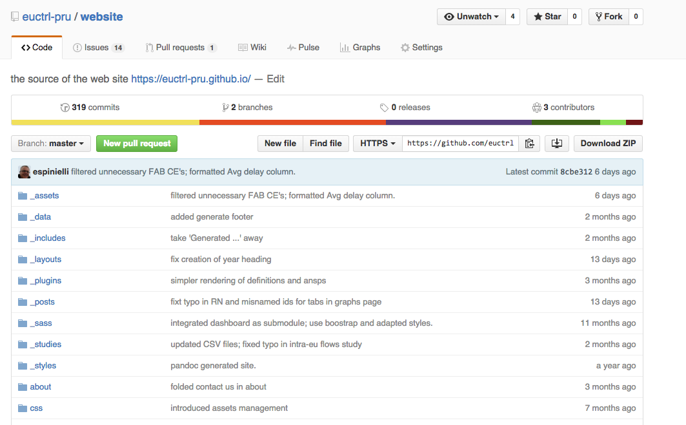
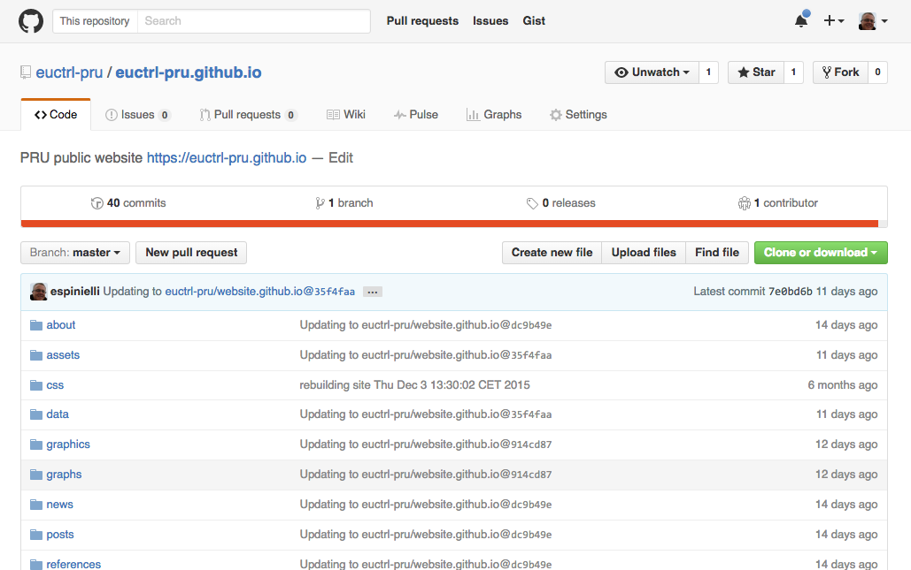
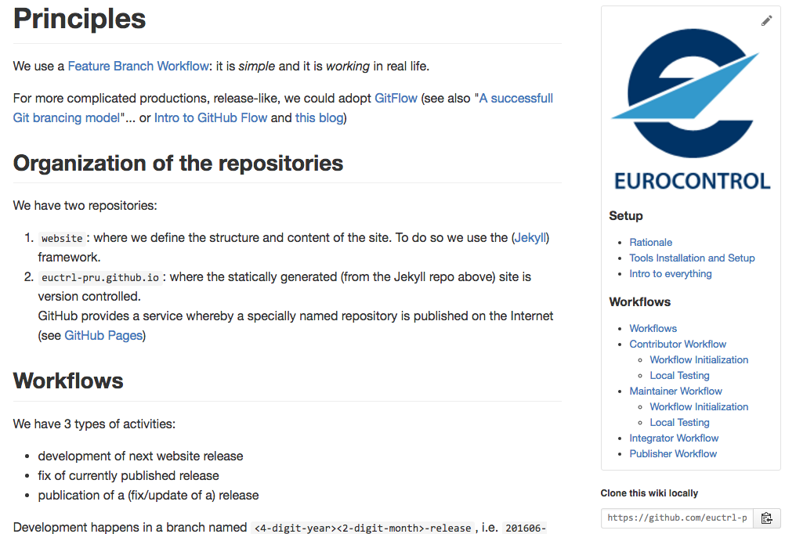
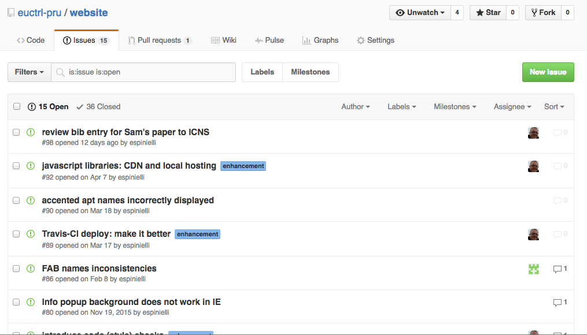
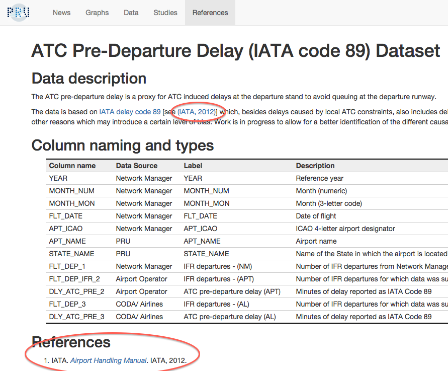
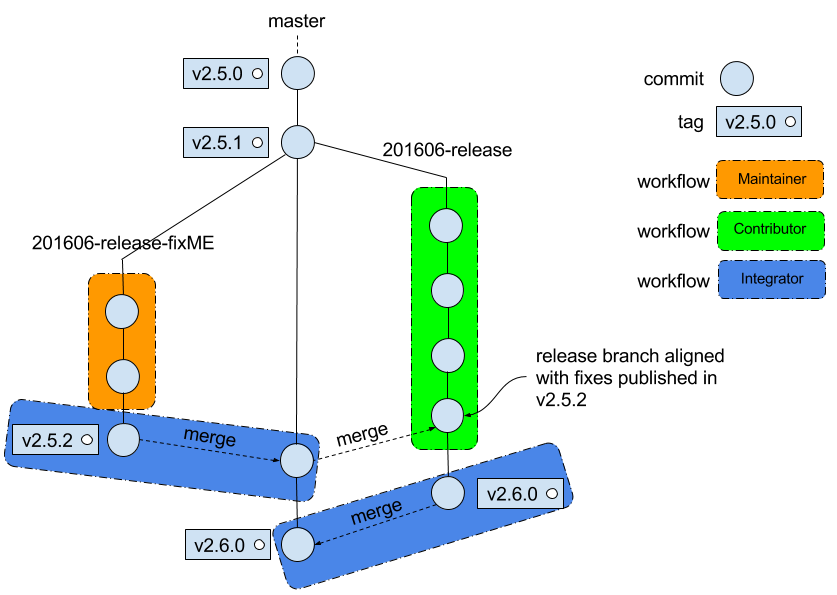
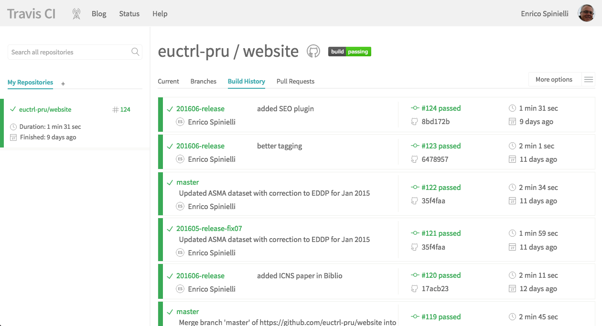
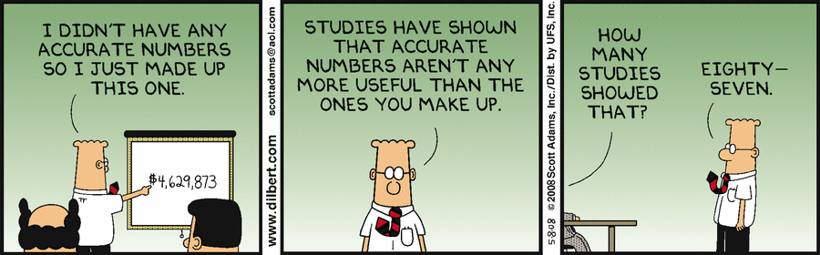

% Data Science<br>Show & Tell
% Enrico Spinielli
% June 9, 2016

##   {data-background-image="images/mindmap.jpg" data-background-size="1000px" data-background-position="bottom"}

## Given:
> - life is *short*
> - I am lazy
> - You should not lie
> - Humans are intelligent (w/ caveats ;-)
> - ... and not all of them are working at Eurocontrol

## ...it follows
> - I'll (procastinate on boring stuff and only) work on useful/fun projects
> - Automation saves me from repeating boring and/or forgotten tasks
> - I'll be open to let others critisize/scrutinize/learn
> - ...and I'll learn back from them
> - I'll strive to produce truthful explanations/visualizations

# Let's Do It!

## The Axioms (IMHO) {data-background-image="images/mindmap.jpg" data-background-size="600px" data-background-position="bottom"}

- Value of data --> visualization
- Visualization --> WWW
- Make *data* available


<div class="notes">
- *no Web*: then you do not exist, i.e. EC/PRB/PRU
- *no boring stuff*: enough of it, do better.
- *truthful*: no evil
- *visualization*: humans perception & best practices!
- data availability!
</div>


## The Plan<br><small>(Jan 2015)</small>

- Generate a (static) website for the PRU
- Version control it all
- Automate!


<div class="notes">
- *static*: no need of server, no authentication, no hacks!
- *version control*: done by systems not humans, i.e. naming convention in folders...
- *automation*: the only way to scale
</div>


# Now <br><small>one year and a half later</small> {data-background-image="images/website-home.png" data-background-size="850px" data-background-position="bottom"}

## Sections {data-background-image="images/website-bar.png" data-background-size="900px"}

## Demo time

* Make sure to navigate from Data to Metadata (last column in the table)
* Check the Graphs out
* Enjoy the Studies

[the official PRU site, http://ansperformance.eu](http://ansperformance.eu){target="_blank"}


# Features


## {height=100px width="auto"}  &  {height=100px width="auto"}

{height=700px width="auto"}


## {height=150px width="auto"} <small>`<user>.github.io`</small> 

{height=700px width="auto"}


## Tech Docs

{height=700px width="auto"}


## Release

{height=700px width="auto"}


## Bugs

{height=700px width="auto"}


## Editing

- easy, i.e. textual (ASCII, no HTML): separate *content* from *style*
- nice Math (via [MathJax][mathjax]):   $$f(x)=\sum_{n=0}^\infty\frac{f^{(n)}(a)}{n!}(x-a)^n$$
- bibliography: cite and style
- templates for different kind of pages (Definitions, list of ANSP's, RN's)


## Markdown {height=100px width="auto"}

No need to edit in HTML: we (mainly) use [Markdown][markdown] (from [Pandoc][pandoc])

```
## Methodology

[Horizontal en-route flight efficiency methodology](/r/m/hfe_pi.html)
is fully consistent with the Single European Sky (SES)
Performance Scheme [see ].

## Column naming and types

### HFE data

{:.metatable}
| Column name | Src | Label     | Column description    | Example |
|-------------|-----|-----------|-----------------------|---------|
| YEAR        | NM  | YEAR      | Reference year        | 2014    |
| MONTH_NUM   | NM  | MONTH_NUM | Month (numeric)       | 9       |
| MONTH_MON   | NM  | MONTH_MON | Month (3-letter code) | JAN     |
```


## Biblio {data-background-image="images/website-biblio.png" data-background-size="820px"}

[//c]:{height=700px width="auto"}


## Generation

* from DB queries to website: scripts
* [Jekyll][jekyll]: MD -> HTML
* [Pandoc][pandoc]: MD -> PDF
* some from Rmarkdown/[[knitr]] in the near future


## Workflows

{height=670px width="auto"}


## Trigger {data-background-image="images/ci.png" data-background-size="820px"}

## [Travis CI](https://travis-ci.org/euctrl-pru/website/builds){target="_blank"}

{height=700px width="auto"}

<div class="notes">
- But we **NEED MORE** to scale: for example checks on data consistency
</div>


# ToDo's

## DB {data-background-image="images/mindmap.jpg" data-background-size="600px" data-background-position="bottom"}
> - new schema for production: PRUPROD
> - use current ones for development (PRUDEV) and testing (PRUTEST)
> - version control [PL]SQL code, i.e. which code was used to produc which indicators
> - *version control* the DB used for prod: regulatory repository


## Data

> - clarify dimensions
> - improved the [Meta](http://localhost:4000/references/) part of it: definitions, methodology
> - add more data and (web) API (see [ICAO iSTARS][istars])
> - generate the spreadsheets if CSV files/API are not enough

<div class="notes">
- Metadata is to be transparent and to avoid confusion, i.e. define what you name/use (delay, trajectory, FIR)
- the API is to make the data available: remember we are not the only smart ones around
</div>


## Viz {data-background-video="media/bullets.mp4" data-background-video-loop="true"}

## More Viz

> - more Studies/Articles w/ interactivity (see NYT, WP)
> - more thinking of what is worth plotting
> - more graphs in Graphs
> - one year old experiment [www](http://bl.ocks.org/espinielli/a452dcff7a801fdc656f6218fd53979e){target="_blank"}
> - a recent one w/ STATFOR [www](http://bl.ocks.org/espinielli/4d6f69898852877e39334a1f01277d4d){target="_blank"}


<div class="notes">
# Wild thoughts
* personally I am not interested in BI or industrial-like dashboards
* I know that little is used of our NMIR

## Just mine ones

> - PRR live in the website and PDF generated from the source in git repo
> - add Jypiter notebooks to the website for case studies
</div>


# Conclusions {.conclusions}

## We *want* you! {.slide: data-background="images/we-want-you.png" data-background-transition="zoom" data-background-size="100%" data-state="wewantyou"}

[//1]: # (the question http://stackoverflow.com/q/32055640/963575 inspired me to define)
[//2]: # ('data-state' and use it in the following style snippet: opacity 0.5 only for)
[//3]: # (this slide's background image)

<style>html.wewantyou .backgrounds {opacity: 0.15;}</style>

>   * Share knowledge (or lack of)
>   * Learn from and know each other
>   * Discover internal and external datasets
>   * critisize **&** propose alternatives
>   * signal things you saw and would like to see implemented in our site<br>
>     For example [NYT][nyt],
>     Bloomberg ([1](http://www.bloomberg.com/graphics), [2](http://www.bloomberg.com/visual-data/)),
>     [WP][wp], [ProPublica][propublica],
>     [The Guardian][guardian], [Financial Times][ft] ... have fantastic infographics

## We *hear* you!

>   * emails with questions, proposals are a good start
>   * you are always welcome to come and chat (but bring your coffee)
>   * present at the next *Show & Tell*


##  {data-background="images/wordcloud.svg" data-background-transition="zoom"}


# References and Inspirations

## Tools

* [Git][git]
* [GitHub][github]
* [TravisCI][travisci]
* [D3.js][d3]
* [Vega][vega]
* [Google Charts][gcharts] (w/ caveats)
* R: [ggplot2], [dplyr], [R Studio][rstudio]

<div class="notes">
* Google Charts cannot be run offline
* GCharts make your life difficult if you want to load data locally, i.e. CSV instead of Google Spreadsheets
</div>


## Social

* D3.js: [Mike Bostock][mike], [Ian Johnson][ian], [Elijah Meeks][elijah],
  [Nadieh Bremer][nadieh], [Susie Lu][susie], [Christophe Viau][christophe]
* Viz gurus: [Alberto Cairo][alberto], [Stephen Few][stephen], [Edward Tufte][edward],
  [Enrico][enrico] [Bertini][bertini], [Maarten Lambrechts][maarten],
  [Jonathan Corum][jonathan], [Jeffrey Heer][jeff] ...
* Twitter: big inspiration from `#d3js` `#dataviz`
* Statistics: [Hadley Wickham][hadley]
* Conferences: [Eyeo Festival][eyeofestival], [OpenVis Conference][openvisconf]
* Awards: [Malofiej][malofiej], [Data Journalism Awards][ddj]
* Newspapers: [NYT][nyt], [The Guardian][guardian], [Bloomberg][bloomberg],
  [The Washington Post][wp], [Pro Publica][propublica],
  [National Public Radio][npr] ...

## Books
Yes, you still have to study!

* Tufte, Edward
* Cairo, Alberto
* Few, Stephen


## Credit Where it is Due

* PRU animated logo inspired by [UW Interactive Data Lab][idl]
* Thank You cloud generated w/ [Jason Davies][jason]' [Word Cloud generator][wordcloud]
* Search Engine functionality from [DuckDuckGo API][ddgo]
* Flight Flows inspired by [Global Flow of People][fop] and
  made possible by adapting [Vienna Institute of Demography](http://www.oeaw.ac.at/vid/)
  shared [source code][fopcode]
* STATFOR's experiment inspired by [Amanda Cox][amanda]'s [NYT article][nytcox]
  via [Vega Editor][vega] [example][vegacox]


# Trivia

## Automation 1

[xkdc 1319](http://xkcd.com/1319/) and [explanation](https://www.explainxkcd.com/wiki/index.php/1319:_Automation)

{height=500px width="auto"}

Title text: 'Automating' comes from the roots 'auto-' meaning 'self-', and 'mating', meaning 'screwing'.


## Automation 2

[xkdc 1205](http://xkcd.com/1205/) and [explanation](https://www.explainxkcd.com/wiki/index.php/1205:_Is_It_Worth_the_Time%3F)

{height=500px width="auto"}

<small>Title text: Don't forget the time you spend finding the chart to look up what you save.
And the time spent reading this reminder about the time spent. And the time trying to figure out
if either of those actually make sense. Remember, every second counts toward your life total,
includingthese right now.</small>


## Correlation

[xkdc 1205](http://xkcd.com/552/) and [explanation](https://www.explainxkcd.com/wiki/index.php/552:_Correlation)

{height=400px width="auto"}

Title text: Correlation doesn't imply causation, but it does waggle its eyebrows suggestively and
gesture furtively while mouthing 'look over there'.


## Data Accuracy 1

[Dilbert 2008-05-07](http://dilbert.com/strip/2008-05-07)

{height=400px width="auto"}


## Data Accuracy 2

[Dilbert 2008-05-08](http://dilbert.com/strip/2008-05-08)

{height=400px width="auto"}


## Convincing

[xkdc 833](http://xkcd.com/833/) and [explanation](http://www.explainxkcd.com/wiki/index.php/Convincing)

{height=500px width="auto"}

<small>Title text: Don't forget the time you spend finding the chart to look up what you save.
And the time spent reading this reminder about the time spent. And the time trying to figure out
if either of those actually make sense. Remember, every second counts toward your life total,
includingthese right now.</small>


## Big Data

{height=600px width="auto"}


[git]: <https://git-scm.com/> "Git"
[github]: <https://github.com/> "GitHub"
[travisci]: <https://travis-ci.org/> "Travis CI"
[prutravisci]: <https://travis-ci.org/euctrl-pru/website/builds> "PRU website Travis CI builds"
[jekyll]: <https://jekyllrb.com/> "Jekyll"
[d3]: <https://d3js.org/> "D3"
[markdown]: <https://daringfireball.net/projects/markdown/> "Markdown"
[pandoc]: <http://pandoc.org/> "Pandoc"
[r]: <https://www.r-project.org/> "R language"
[rstudio]: <https://www.rstudio.com/> "R Studio"
[knitr]: <http://yihui.name/knitr/> "knitr"
[mathjax]: <https://www.mathjax.org/> "MathJax"
[blockbuilder]: <http://blockbuilder.org/> "Block Builder"
[gcharts]: <https://developers.google.com/chart/> "Google Charts"
[vega]: <http://vega.github.io/vega-editor/> "Vega"
[ggplot2]: <http://ggplot2.org/> "ggplot2"
[dplyr]: <https://cran.rstudio.com/web/packages/dplyr/vignettes/introduction.html> "dplyr"
[pages]: <https://pages.github.com/> "GitHub Pages"
[raw]: <http://raw.densitydesign.org/> "Raw"

[nadieh]: <http://www.visualcinnamon.com/> ""
[mike]: <https://bost.ocks.org/mike/> "Mike Bostock"
[elijah]: <http://elijahmeeks.com/> "Elijah Meeks"
[ian]: <http://enja.org/> "Ian Johnson"
[alberto]: <http://www.thefunctionalart.com/> "The Functional Art"
[stephen]: <https://www.perceptualedge.com/> "Stephen Few"
[edward]: <https://www.edwardtufte.com/tufte/> "Edward Tufte"
[enrico]: <http://enrico.bertini.io/> "Enrico Bertini"
[bertini]: <http://fellinlovewithdata.com/> "Fell in Love with Data"
[susie]: <http://susielu.com/> "Susie Lu"
[christophe]: <http://www.biovisualize.com/> "Christophe Viau"
[maarten]: <http://www.maartenlambrechts.be/> "Maarten Lambrechts"
[hadley]: <http://hadley.nz/> "Hadley Wickham"
[jonathan]: <http://13pt.com/graphics/> "Jonathan Corum"
[jeff]: <http://homes.cs.washington.edu/~jheer/> "Jeffrey Heer"
[amanda]: <https://twitter.com/amandacox> "Amanda Cox @ Twitter"

[istars]: <http://www.icao.int/safety/iStars/Pages/API-Data-Service.aspx> "ICAO iSTARS"

[openvisconf]: <https://openvisconf.com/> "OpenVis Conference"
[eyeofestival]: <http://eyeofestival.com/> "Eyeo Festival"
[malofiej]: <http://www.malofiejgraphics.com/> "Malofiej Award"
[ddj]: <http://www.globaleditorsnetwork.org/programmes/data-journalism-awards/> "Data Journalism Award"

[propublica]: <https://www.propublica.org/data/> "ProPublica"
[guardian]: <http://www.theguardian.com/graphics> "The Guardian graphics"
[ft]: <http://blogs.ft.com/ftdata/category/graphics/> "Financial Times graphics"
[nyt]: <http://www.nytimes.com/interactive/2015/us/year-in-interactive-storytelling.html?_r=0> "New York Time 2015 graphics"
[bloomberg]: <http://www.bloomberg.com/graphics> "Bloomberg graphics"
[wp]: <https://www.washingtonpost.com/graphics/national/2015-in-graphics/> "The Washington Post 2015 graphics"
[npr]: <http://www.npr.org/tags/147165367/graphics> "NPR"

[idl]: <http://idl.cs.washington.edu/> "University of Washington Interactive Data Lab"
[wordcloud]: <https://www.jasondavies.com/wordcloud/> "Word Cloud generator"
[jason]: <https://www.jasondavies.com/> "Jason Davies"
[ddgo]: <https://duckduckgo.com/api> "DuckDuckGo Search API"
[fop]: <http://www.global-migration.info/> "Global Flow of People"
[fopcode]: <http://github.com/null2/globalmigration> "Circular Plot source code"
[vegacox]: <http://vega.github.io/vega-editor/?mode=vega&spec=budget_forecasts> "Vega Editor: Budget Forecasts"
[nytcox]: <http://www.nytimes.com/interactive/2010/02/02/us/politics/20100201-budget-porcupine-graphic.html> "NYT: Budget Forecasts, Compared With Reality"
